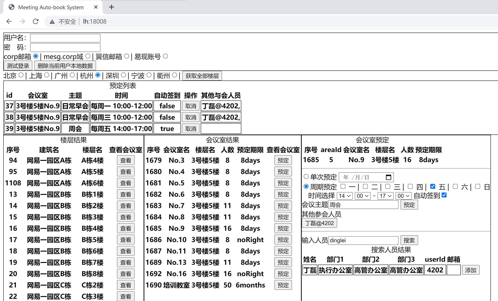

# 工程介绍

## 背景
经常会有想要使用会议室的时候，发现忘记预定了会议室，导致没有会议室可以用，针对这个情况，开发了本工具。

## 功能
在本地保存了用户名密码，通过接口登录获取 cookie，来预定未来时间的会议室。支持单日预定或者按照星期预定。

## 使用方法
输入用户名密码，点击“测试登录”，会请求“网易会议预定系统”进行登录，并获取 cookie，保存至本地。

当本地保存了用户信息之后，后续开关浏览器不必输入用户信息（登录之后通过 cookie 维护）。当预定操作时会自动登录。然后点击“获取全部楼层”展示该区域的会议室的楼层。点击楼层的“查看”进行会议室的查看。在预定期限不为”noRight”的情况下，则可以通过右侧进行选择未来时间进行预定。

每天凌晨 2:00，会扫描本地预定记录，预定该会议室预定天数之后的，做到快人一步。

适配会议签到，可以勾选是否签到来自动签到。

### 工具截图

## 工程启动方式
下载 jar 包，安装 Java 环境，运行 `java -jar 文件名`，在浏览器打开 http://127.0.0.1:18008，即可食用。

Java 环境要求：v0.3.0 之前版本使用 Java 8 构建，v0.3.0 之后版本使用 Java 17 构建。

若需要部署服务器，需要能够访问 https://meeting.oa.netease.com 的网络才能使用本工具。

## release jars
历史版本 jar 包在 release 下可以找到，或者 [点击此处直达](https://g.hz.netease.com/xiejiaxing/book-meeting/-/releases)。

有旧版本基于 Spring Boot 2.6 的 Java 8 构建的，也有新功能的版本基于 Spring Boot 3.0 的 Java 17 构建的。

## GitLab 地址
[https://g.hz.netease.com/xiejiaxing/book-meeting](https://g.hz.netease.com/xiejiaxing/book-meeting)

## 更新日志

### v0.3.1.1
- 优化：自定义 SQLite 数据库储存位置

### v0.3.1.0
- 新增：使用 SQLite 数据库，废弃本地文件储存
- 优化：部分代码逻辑
- 其他：需要重新登录并且重新预定

### v0.3.0.0
- 升级：Spring Boot 版本至 3.0.0-M1
- 升级：Java 版本至 17（需要改用 Java 17）
- 新增：引入 SQLite 依赖包

### v0.2.2.0
- 新增：提供会议室自动签到功能
- 升级：升级项目的部分版本依赖
- 优化：优化部分代码的逻辑

### v0.2.0
- 新增：提供会议室按照星期周期预定
- 更改：cookie 过期时间设为 `Integer.MAX_VALUE`
- 修复：预定失败不能继续预定下一个
- 重构：部分前端代码

### v0.1.2
- 提供预订会议的查询和删除功能

### v0.1.1
- 登录用户信息在成功保存后，用 cookie 保存，不用再输入用户信息
- 用户密码进行简单加密
- 新增自定义会议名称
- 优化代码
- 修复读取文件未被释放的问题

### v0.1.0
- 初版系统，支持有限功能
- 普通的 `alert` 提示
- 点击“测试登录”时候，需要等待模拟登录，耗时可能要几秒，需要稍等
- 暂仅支持具体日期时间预定
- 本地用户名密码明文保存
- 非 corp 登录方式在查看、预定的时候需要勾选对应的登录方式
- 需要注意输入边界等条件，误输入限制有限
- 暂仅支持预定，不支持查询预定列表或者修改删除
- 极为先进的前后端不分离技术，和极为先进的代码少注释技术，和极为先进的代码冗余技术，和极为先进的 bug，提升代码不可读性